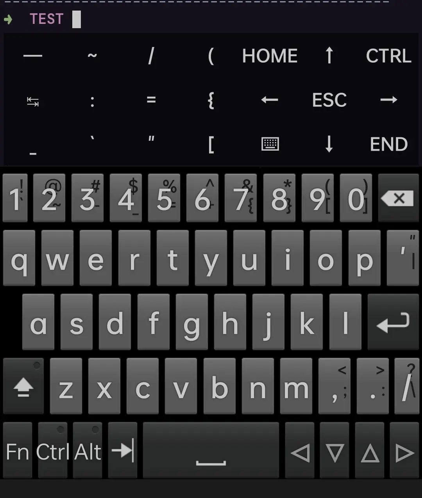
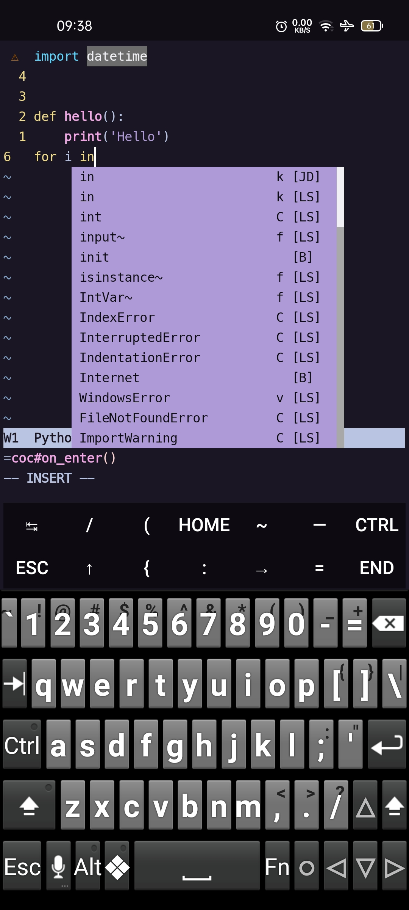

Some dot files on Termux Android app.

- `.bashrc` : not much configured since I use `omz` aka `.zshrc` 

- `.zshrc` : mostly shortcuts and alias, some handy functions

- `.termux/termux.properties` : customised Termux extra keys for using with `neovim`

- `.init.vim` : mainly configured for **Python** and **JavaScript**. Most snippets are adapted here and there from the Internet overtime.

They may not work for you, consider not blindly copy and paste.

+ Extra keys

+ Neovim

