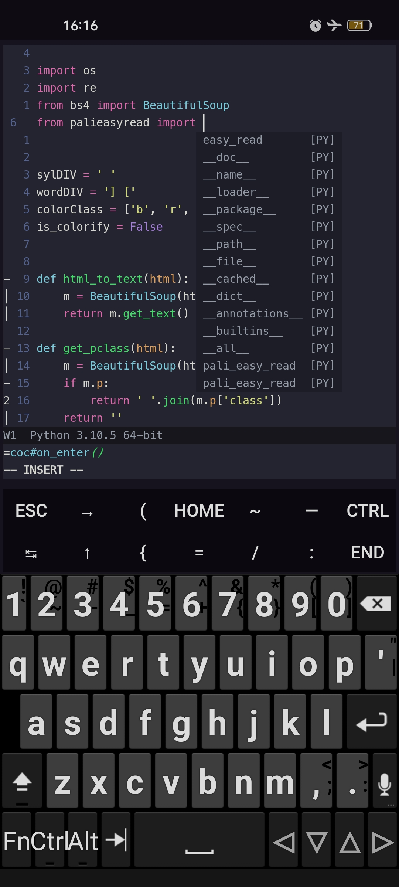

Some Termux dot files on my Android phone.

- `.zshrc` : mostly shortcuts and alias
- `.bashrc` : not much configured since I use `omz` aka `.zshrc` 
- `termux.properties` : extra keys for `neovim`

- `.init.vim` : mainly configured for **Python** and **JavaScript**. Most snippets are adapted here and there fro, the Internet overtime.

They may not work for you, consider not blindly copy and paste.
